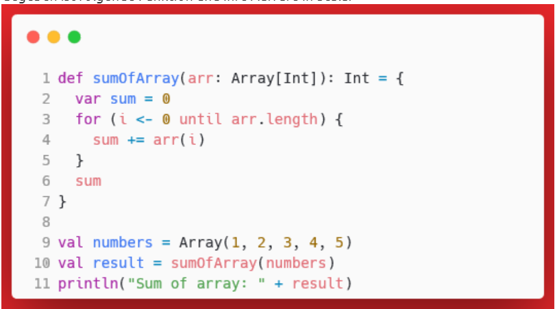
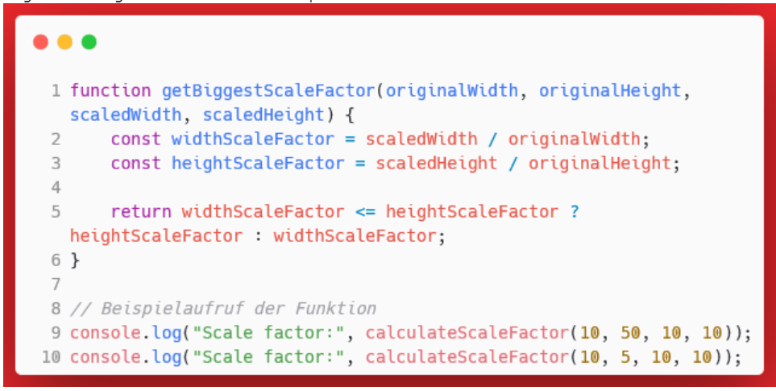
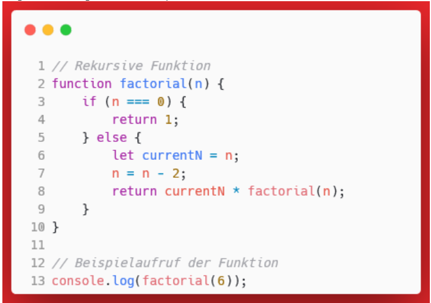

# Zusammenfassung Prüfung 1
## deklarativ vs. imperativ
### deklarativ
- 'was' wird beschrieben und nicht wie / nur das Endprodut oder Zielzustand
### imperativ
- 'wie' wird beschrieben
- jeder Schritt wird vorgegeben
- Weg zum Ziel wird beschrieben

## Programmierparadigmen
- fundamentaler Programmierstil
- Herangehensweise
- eine Programmiersprache erlaubt häufig mehrere Paradigmen
- Mischen auch möglich
### Beispiele
- Prozedurale Programmierung: Anweisung für Anweisung -> Verwendung in Bash- Shell Scripten, Assambler, PHP
- Objektorientierte Programmierung: Klassen etc. -> Java, C#, PHP
- Funktionale Programmierung: wird in Funktionen gegliedert, deklarativ -> Scala, JavaScript, Haskel

## Vorteile und Nachteile der Funktionalen Programmierung
### Vorteile
- keine Seiteneffekte
- Einfacher zu testen, lesen und debuggen
- Besser geeignet für paralelle Prozesse
### Nachteile
- Performance ist eingeschränkt
- Neue Denkweise -> Übung

## Ecolm Prüfung
Probeprüfung

Welche Aussagen in Bezug auf die funktionale Programmierung sind richtig, welche Aussagen sind falsch?
* Die funktionale Programmierung hat den Vorteil, dass der Code performanter ist in der Ausführung, weil der Code tendenziell kürzer wird wie in anderen Programmierparadigmen.
    * Falsch
* Unit-Tests lassen sich beim funktionalen Programmieren einfacher realisieren, weil bei der funktionalen Programmierung immutable Values verwendet werden, was dazu führt, dass keine zusätzlichen Umgebungsvariablen für einen Testcase gesetzt werden müssen.
    * Richtig
* Ein Vorteil der funktionalen Programmierung ist, dass der Code sehr klar und einfach verständlich wird (natürlich nur dann wenn sich die Entwickler auch an die Regeln der funktionalen Programmierung konsequent halten).
    * Richtig
* Die funktionale Programmierung bewirkt, dass der Grad der Abstraktion des Codes tendenziell grösser wird. Es wird auf einer "Metaebene" programmiert. Das WAS steht im Zentrum und nicht das WIE.
    * Richtig

Welche Aussagen in Bezug auf die Fachbegriffe imperativ und deklarativ sind richtig, welche Aussagen sind falsch?
* Die Wahl des Funktionsnamens sollte in der deklarativen Programmierung vor allem Verben enthalten (der Funktionsname soll die Aktionen die die Funktion ausführt erklären).
    * Falsch
* Bei der imperativen Programmierung wird der Fokus darauf gelegt, was getan werden muss (und nicht wie es getan werden muss).
    * Falsch
* In der funktionalen Programmierung soll der Code deklarativ umgesetzt werden.
    * Richtig
* Die Anforderung "Berechne den Wordscore, indem du Buchstaben für Buchstaben im Wort durchgehst und den Zähler für den Wordscore bei jedem Buchstaben der kein a ist um eines erhöhst" ist eine deklarative Anforderung.
    * Falsch
* Die Anforderung "Der Wordscore ist die Länge eines Wortes ohne die Buchstaben a mit zu berücksichtigen" ist eine deklarative Anforderung.
    * Richtig

Welche Aussagen in Bezug auf pure functions sind richtig, welche Aussagen sind falsch?
* Die Regel, dass eine pure function immer nur einen Rückgabewert haben darf bedeutet, wenn ein Array mit mehreren unterschiedlichen Werten (int, String, Objekt) zurück gegeben wird, dann ist diese Regel verletzt.
    * Falsch
* Wenn eine Funktion neben dem Normalen Return-Wert zusätzlich eine Exception werfen kann, dann ist diese Funktion impure weil die Regel "Nur ein Rückgabewert" verletzt wird.
    * Richtig
* Eine pure function ist immer auch referenziell transparent.
    * Richtig
* Innerhalb des Funktionsbodies dürfen Variablen definiert und auch verändert werden und dennoch gilt die Funktion als pure.
    * Richtig
* Eine pure function verhindert nicht in jedem Fall Seiteneffekte. Beispielsweise könnte mit einer debugging-Ausgabe innerhalb der pure function ein Seiteneffekt erzeugt weden.
    * Falsch
* Dank der eager evaluation kann die Performance von pure functions etwas optimiert werden.
    * Falsch
* Mit call by reference kann dafür gesorgt werden, dass eine Kopie der Daten der Methode übergeben werden. D. h. die Parameter dürfen innerhalb der Methode direkt verändert werden ohne dass eine der Regeln für pure functions verletzt wäre.
    * Falsch

Gegeben ist folgende Funktion und ihre Aufrufe in Scala:

Welche Aussagen in Bezug auf den gegebenen Code sind richtig, welche Aussagen sind falsch?
* Bei der Funktion sumOfArray handelt es sich um eine pure function, weil alle Regeln für pure functions eingehalten werden.
    * Richtig
* Die Funktion sumOfArray ist impure, weil sie ein for-Loop enthält. Um pure zu sein, müsste dies mit einer Rekursion gelöst werden.
    * Falsch
* Würde Zeile 2 als val deklariert, würde der Kompiler eine Fehlermeldung werfen.
    * Richtig

Gegeben ist folgende Funktion in JavaScript:

Welche Aussagen in Bezug auf den Code sind richtig, welche Aussagen sind falsch?
* Bei der Funktion getBiggestScaleFactor handelt es sich um eine pure function, weil alle Regeln für pure functions eingehalten werden.
    * Falsch
* Die Funktion getBiggestScaleFactor verletzt die Regel, dass nur ein Return-Value vorhanden sein darf und ist deshalb impure
    * Richtig
* Die Funktion ist nur pure weil die beiden Variablen widthScaleFactor und heightScaleFactor als const definiert wurden.
    * Falsch

Welche Aussagen in Bezug auf immutable values sind richtig, welche Aussagen sind falsch?
* Call by value bedeutet, dass bei einem Funktionsaufruf der Parameter beim Aufruf kopiert wird und die Kopie der Funktion als Parameter übergeben wird.
    * Richtig
* Hinter dem Fachbegriff immutable value steht das Konzept, dass keine bestehenden Daten verändert werden dürfen. Dies kann Seiteneffekte im Code vermeiden.
    * Richtig
* Call by value ist ausreichend um dafür zu sorgen, dass innerhalb der Funktion keine bestehenden Werte verändert werden.
    * Falsch
* Wenn eine rekursive Funktion eine globale Variable verändert, dann ist das Konzept von immutable values verletzt obwohl Rekursion verwendet werden kann, um das Konzept von immutable values umzusetzen.
    * Richtig

Gegeben ist folgende JavaScript-Funktion:

Beachten Sie für die Beantwortung der Fragen, dass bei JavaScript einfache Werte wie ein Integer immer als "call by value" übergeben werden. Objekte werden in JavaScript standardmässig immer als "call by reference" übergeben.

Welche Aussagen in Bezug auf den Code sind richtig, welche Aussagen sind falsch?

* Diese Funktion ist impure, weil sie zwei return-Statements beinhaltet.
    * Falsch
* Diese Funktion berechnet beim Beispielsaufruf 6*4*2*0.
    * Falsch
* Das Abbruch-Kriterium der rekursiven Funktion befindet sich auf Zeile 3 und der Abbruch der Rekursion auf Zeile 4.
    * Richtig
* Zeile 8 macht aus der Funktion eine rekursive Funktion.
    * Richtig
* Diese Funktion ist impure, weil das Argument auf Zeile 7 verändert wird.
    * Falsch
* Diese Funktion bewirkt beim Aufruf factorial(5) einen Endlosloop. 
    * Richtig
